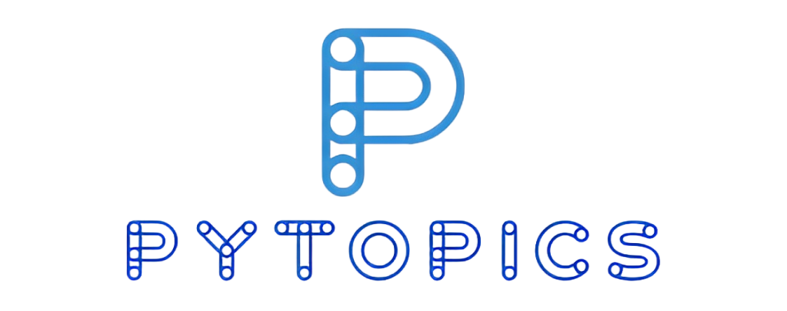

<h4 align="center">
  
</h4>
<h1>
  <h1 align="center">
    <h1 align="center" style="color:teal">Simplifying Python Learning</h1>
  </h1>
</h1>

 

# What is PyTopics 🤔?

The "PyTopics" repository is one of a kind, collection of easy-to-understand Python templates aimed at helping beginners learn the language. Each template covers a specific topic and includes comments explaining each section of the code. The templates are designed to be simple and concise, with an emphasis on readability and ease of understanding. Whether you're just starting out with Python or looking to brush up on your skills, this repository is a great resource for anyone looking to learn the language in an easy and accessible way.

# Motivation 💡!

The motivation behind creating the "PyTopics" repository was to provide an accessible and easy-to-use resource for people to learn Python. While there is a wealth of great content on social media, it can be difficult to retain information when we are distracted or not fully engaged. Additionally, not everyone has access to social media platforms or may miss out on valuable content. By creating a centralized repository of easy-to-understand Python templates, we hope to provide a valuable resource for anyone looking to learn the language, regardless of their social media presence or distractions. This repository can also serve as a platform for people to share their knowledge and contribute to the learning community.

# Topics List 📝 

## Basic
<ul>
    <li>  </l1>
</ul>

## Conditional Statements
<ul>
    <li>  </l1>
</ul>

## Loops
<ul>
    <li>  </l1>
</ul>

## Function
<ul>
    <li>  </l1>
</ul>

## Tuple
<ul>
    <li>  </l1>
</ul>

## List
<ul>
    <li>  </l1>
</ul>

## Dictionary
<ul>
    <li>  </l1>
</ul>

## Sets
<ul>
    <li>  </l1>
</ul>

## String
<ul>
    <li>  </l1>
</ul>

## Exception Handling
<ul>
    <li>  </l1>
</ul>

## File Handling
<ul>
    <li>  </l1>
</ul>

## Numpy
<ul>
    <li>  </l1>
</ul>

## Pandas
<ul>
    <li>  </l1>
</ul>

## Matplotlib
<ul>
    <li>  </l1>
</ul>

## Statistic
<ul>
    <li>  </l1>
</ul>

# Contributors 🖥️

We welcome contributions to uptrain. Please see our [contribution guide](https://github.com/PyTopics/Py-Topics/blob/main/CONTRIBUTING.md) for details.

